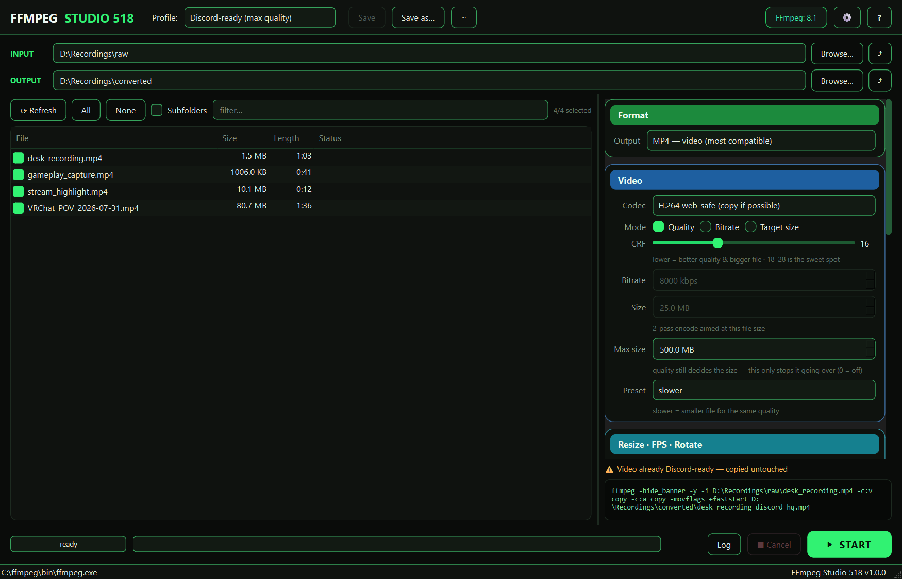

# FFmpeg Studio 518

All of FFmpeg's useful jobs — convert, compress, resize, trim, extract audio,
make GIFs — as a batch tool with named profiles. Point it at a folder, pick a
profile, press start. No command line, no install.

   
  🐧 Linux? Run it from source for now — an AppImage is on the way to the
  <a href="https://github.com/Blise518B/FFmpegStudio518/releases/latest">Releases</a> page.

## What it does

- **Convert & compress** — MP4 / MKV / WebM / MOV / AVI with H.264, H.265,
  VP9 or AV1, plus NVIDIA NVENC when a GPU is detected. Pick quality (CRF),
  a fixed bitrate, or a **2-pass target file size**
- **Share without re-encoding** — the `H.264 web-safe` codec stream-copies
  anything that already plays on Discord and in browsers, and only converts
  what doesn't (RGB 4:4:4, HEVC, 10-bit, AC-3 audio). Add a **Max size**
  ceiling that caps quality mode without inflating short clips
- **RGB 4:4:4 mastering** (`libx264rgb`) for copies that keep full colour
  detail — CRF 0 for mathematically lossless
- **Resize · FPS · rotate** — 4K/1080p/720p/480p, percent or custom (never
  upscales), frame-rate change, rotate & flip
- **Audio** — extract MP3/M4A/Opus/FLAC/WAV, strip it, normalize loudness, or
  fold stereo down to mono with an **equal L+R mix** (fixes VRChat POV
  recordings where the music swings between your ears)
- **Trim & clips** — cut a time range, palette-based GIFs, WebP, thumbnails
- **Profiles** — save a whole setup under a name and reload it in one click;
  rename, export and import them as JSON to share. Fifteen ship with the app,
  and hovering any of them explains what it's for and what it will do
- **Subfolders** — process a whole tree at once, mirrored into the output
  folder, with the output folder itself always skipped
- **Command preview** — the exact ffmpeg command is always on screen, along
  with a note whenever a setting had to be adjusted to make sense

## Quick start

1. Hit the big **Download for Windows** button above — a single file,
   nothing to install
2. Pick an **INPUT** folder (or drag one onto the window). An **OUTPUT**
   folder is suggested for you
3. Choose a profile, tick the files you want, press **START**

No FFmpeg on the PC? The app offers a one-click download on first start and
keeps it to itself — nothing else on the system is touched.

Windows SmartScreen will complain about the unsigned exe —
*More info → Run anyway*.

## Good to know

- Settings and profiles live in `%APPDATA%\FFmpegStudio518`
- A downloaded FFmpeg goes to `%LOCALAPPDATA%\FFmpegStudio518\bin`. To use
  your own instead, drop `ffmpeg.exe` next to the app, or point at it with
  *⚙ → Set FFmpeg location*
- Originals are never modified — results always go to the output folder, and
  existing files get ` (1)` rather than being overwritten unless you turn
  that on in ⚙
- Two themes, **Neon** and **Midnight**, in the ⚙ menu

## From source

    git clone https://github.com/Blise518B/FFmpegStudio518
    cd FFmpegStudio518
    start.bat        # sets up .venv and launches

Python 3.10+. `build.bat` builds the exe. `python -m unittest discover -s
tests` runs the suite (102 tests, including integration tests that drive real
ffmpeg encodes when it's installed).

## License

[MIT](LICENSE)

FFmpeg is a separate project by the FFmpeg developers ([ffmpeg.org](https://ffmpeg.org));
the Windows builds it offers to download come from
[gyan.dev](https://www.gyan.dev/ffmpeg/builds/).

Built with the help of AI.
